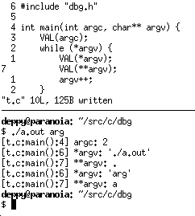

# dbg.h

dbg.h is a header written in C11 which provides the two macros DEBUG and VAL. DEBUG works just like printf except it prefaces each message with the source file, current function and line number. VAL takes a given value and then prints it's name and current value in the correct format depending on it's type (does not work for structs) it also includes the same preface as DEBUG.

# how use?

just include dbg.h in your source and compile with -DENABLE_DBG_H. if ENABLE_DBG_H is removed all instances of the macros will be replaced by noops, this is to make it easy to enable the feature for debugging and having it silently go away for releases, no extra ifdefs required.
